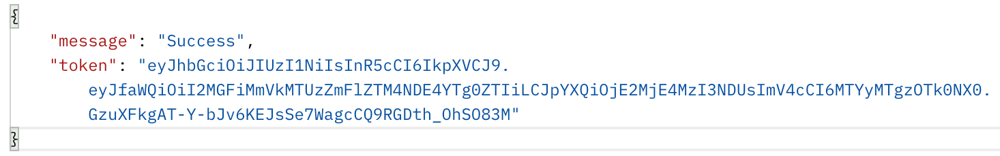

# Introduction
A REST API service using NodeJS to create an Authentication service that authenticates users and return a JWT.

# Register endpoint
POST /api/user/register

##  Sample request body

# Login endpoint
/api/user/login

##  Sample request body

## Sample response on Success

# Profile endpoint
/api/profile

## Sample response on Success

